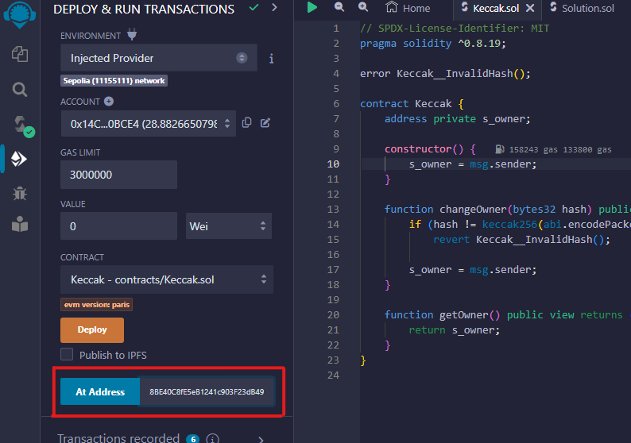
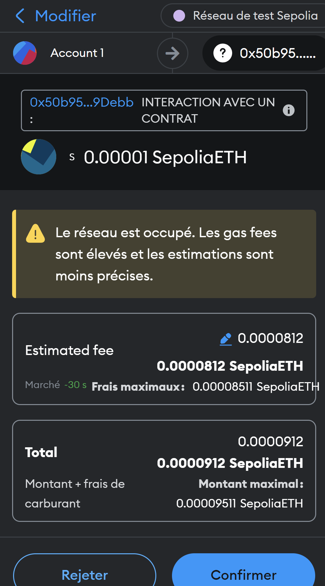

<div align="center">
  <a href="https://hackynov.fr"></a>
</div>

## Contexte

Les challenges Blockchain se déploient et se vérifient sur une autre plateforme qui ressemble à ça :


**La description du challenge :**

```
Votre but est de gagner l'enchère organisée par les pirates de la LockSea. Ils ont amassé un beau butin mais certains de ces pirates ne sont peut-être pas très fidèle à leur équipage. Devenez le topBidder pour remporter le challenge !

Vous utiliserez le réseau de test Sepolia pour faire vos challenges.
```

| Nom du challenge | Catégorie  | Nombre de points | Nombre de résolution |
| ---------------- | ---------- | ---------------- | -------------------- |
| AuctionHouse     | Blockchain | 200              | 4                    |

## Déploiement du challenge

La première étape avant de se lancer dans la résolution de `AuctionHouse` est de connecter son wallet à la plateforme. Il suffit d'avoir un wallet à disposition (par exemple <a href="https://metamask.io/">Metamask</a>) et de quelques **$ETH** de test sur le réseau **Sepolia**. (que vous pouvez récupérer gratuitement sur des faucet comme <a href="https://www.alchemy.com/faucets/ethereum-sepolia">Alchemy</a> ou <a href="https://www.infura.io/faucet/sepolia">Infura</a>)

Un fois cela fait, vous pouvez cliquer sur le bouton `CONNECT` en haut à droite et connecter votre wallet.

Vous pouvez à présent cliquer plus sur le bouton `DÉPLOYER UNE INSTANCE DU CONTRAT` qui aura pour effet de déployer une instance spécialement pour vous. Son adresse s'affichera sur la page et dans la console une fois la transaction traîtée.

Quand vous pensez avoir réussi le challenge, cliquer sur `VÉRIFIER L'INSTANCE`. Vous devrez alors valider deux transactions et si vous avez bel et bien réussi, alors le flag s'affichera sur la page et dans la console.

Introduction terminée, passons à la résolution du challenge !

## Solution

Après avoir déployé votre instance du contrat, nous allons récupérer son adresse et son code pour le charger dans notre éditeur <a href="https://remix.ethereum.org/">Remix IDE</a>


On connecte bien son wallet sur Remix en utilisant l'environnement de déploiement `"Injected Provider"` et on se met sur le réseau de test Sepolia.
On compile le code du contrat à pirater et on colle l'adresse de notre instance dans la partie `At Address` en bas à gauche. On clique ensuite sur ce m^me bouton pour charger notre instance et intéragir avec.



Il s'affiche ensuite en dessous dans la partie `Deployed Contracts`.

### Analyse du code

Nous devons gagner l'enchère et pour ce faire toute les méthodes sont permises, cependant la personne en tête est extrêment riche.

Il faudrait soit dépensé énormément, soit faire preuve d'ingéniosité :D

Nous allons utiliser un smart contract pour appeler les fonctions de paris et nous permettre de gagner à tous les coups.

### Exploitation

En analysant le contrat nous voyons qu'il est possible d'envoyer une transaction inférieur à 0.00001 ether à l'adresse du contrat et qui nous ferait devenir gagnant de l'enchère.



Après un peu de réflexion il semblerait qu'il faudrait faire un pot de vin au gérant de l'enchère (et donc au contrat directement).

Nous pouvons ensuite vérifier qui est devenu le TopBidder et cela devrait être nous.

Une fois que tout est ok nous pouvons aller demander le flag !

### Envoi de l'instance pour vérification

Nous avons atteint l'objectif, c'est à dire devenir owner du contrat, nous pouvons donc retourner sur la plateforme pour faire vérifier notre instance.
Il suffit de cliquer sur le bouton `VÉRIFIER L'INSTANCE` et de valider les deux transactions qui vont apparaître.
Si tout est bon, alors le flag s'affichera sur la page et dans la console.

**BRAVO !**

FLAG : **HN0x03{Br1b3_Th3_D34l3r}**
