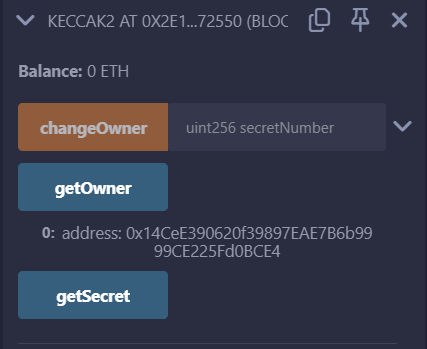
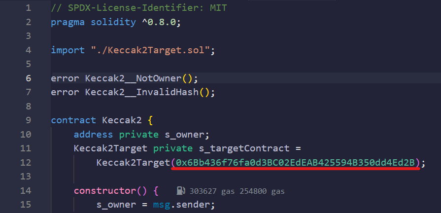
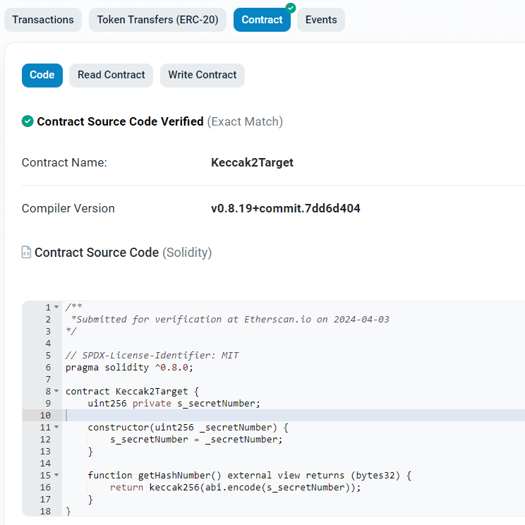

<div align="center">
  <a href="https://hackynov.fr"></a>
</div>

## Contexte

Les challenges Blockchain se déploient et se vérifient sur une autre plateforme qui ressemble à ça :


**La description du challenge :**

```
Vous allez devoir récupérer un nombre secret en analysant le code du contrat. Votre but est de devenir "owner" du contrat en utilisant vos connaissances sur la Blockchain.

Vous utiliserez le réseau de test Sepolia pour faire vos challenges.
```

| Nom du challenge | Catégorie  | Nombre de points | Nombre de résolution |
| ---------------- | ---------- | ---------------- | -------------------- |
| Keccak_2         | Blockchain | 200              | 5                    |

## Déploiement du challenge

La première étape avant de se lancer dans la résolution de `Keccak` est de connecter son wallet à la plateforme. Il suffit d'avoir un wallet à disposition (par exemple <a href="https://metamask.io/">Metamask</a>) et de quelques **$ETH** de test sur le réseau **Sepolia**. (que vous pouvez récupérer gratuitement sur des faucet comme <a href="https://www.alchemy.com/faucets/ethereum-sepolia">Alchemy</a> ou <a href="https://www.infura.io/faucet/sepolia">Infura</a>)

Un fois cela fait, vous pouvez cliquer sur le bouton `CONNECT` en haut à droite et connecter votre wallet.

Vous pouvez à présent cliquer plus sur le bouton `DÉPLOYER UNE INSTANCE DU CONTRAT` qui aura pour effet de déployer une instance spécialement pour vous. Son adresse s'affichera sur la page et dans la console une fois la transaction traîtée.

Quand vous pensez avoir réussi le challenge, cliquer sur `VÉRIFIER L'INSTANCE`. Vous devrez alors valider deux transactions et si vous avez bel et bien réussi, alors le flag s'affichera sur la page et dans la console.

Introduction terminée, passons à la résolution du challenge !

## Solution

Après avoir déployé votre instance du contrat, nous allons récupérer son adresse et son code pour le charger dans notre éditeur <a href="https://remix.ethereum.org/">Remix IDE</a>


On connecte bien son wallet sur Remix en utilisant l'environnement de déploiement `"Injected Provider"` et on se met sur le réseau de test Sepolia.
On compile le code du contrat à pirater et on colle l'adresse de notre instance dans la partie `At Address` en bas à gauche. On clique ensuite sur ce m^me bouton pour charger notre instance et intéragir avec.


Il s'affiche ensuite en dessous dans la partie `Deployed Contracts`.
Le but est de devenir owner du contrat. On voit une fonction `getOwner()` en visibilité public : en l'appelant on récupère owner actuel qui n'est évidemment pas notre adresse de wallet.



### Analyse du code

On remarque dans le code une fonction qui nous permet de devenir owner : `changeOwner()`. Elle prend en paramètre un **nombre secret** que nous devons trouver et si l'on donne le bon, alors on récupère l'ownership de l'instance.
On voit que le contrat le compare au hash d'un nombre stocké sur un autre contrat dont l'adresse est : **0x6Bb436f76fa0d3BC02EdEAB425594B350dd4Ed2B**.



On va donc devoir aller chercher ce nombre secret dans ce contrat.
Direction <a href="https://sepolia.etherscan.io/">Etherscan</a> pour regarder si le contrat a été vérifié.

### Exploitation

Le contrat est bien vérifié et nous avons donc accès à son code. On voit que le secret number est donné au constructeur lors du déploiement du contrat.



Si on descend plus bas dans l'onglet "Contract" on peut récupérer la valeur qui a été donné en constructeur à la base.
Une autre méthode aurait été de récupérer la valeur du Slot#1 du Storage de ce contrat. Mais nous utiliserons cette méthode pour un autre challenge.


Il ne nous reste plus qu'à appeler notre fonction pour changer l'ownership du contrat en spécifiant en argument notre nombre secret.


nous somme maintenant owner du contrat, nous pouvons aller demander le flag !

### Envoi de l'instance pour vérification

Nous avons atteint l'objectif, c'est à dire devenir owner du contrat, nous pouvons donc retourner sur la plateforme pour faire vérifier notre instance.
Il suffit de cliquer sur le bouton `VÉRIFIER L'INSTANCE` et de valider les deux transactions qui vont apparaître.
Si tout est bon, alors le flag s'affichera sur la page et dans la console.

**BRAVO !**

FLAG : **HN0x03{3tH3rSc4n_4_3v3R}**
